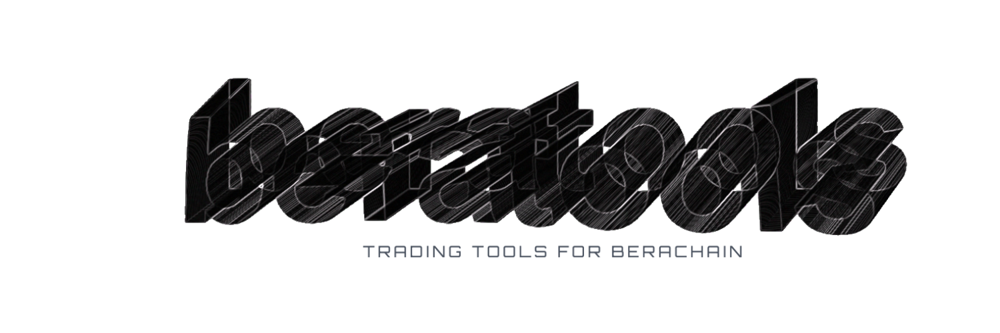
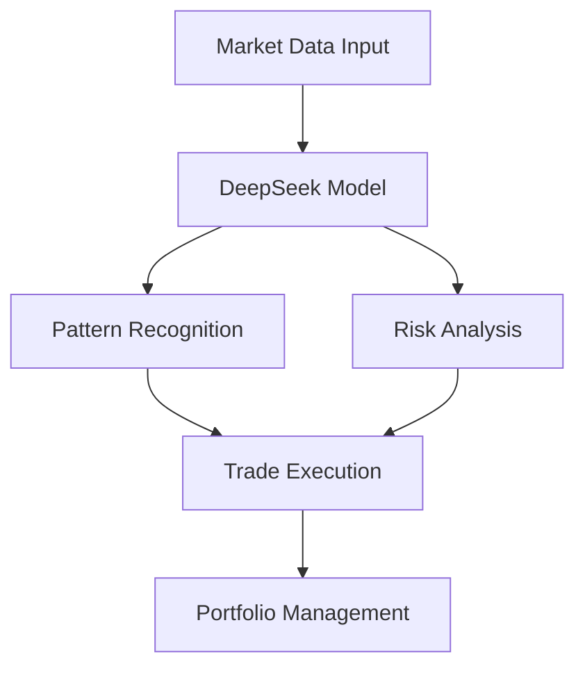

# BeraTools AI Trading System

<div align="center">
  
  
  
  
  
  
  *Advanced AI-powered trading system for BeraChain utilizing deep learning and quantitative analysis*
</div>

## Technical Overview

BeraTools implements a sophisticated artificial intelligence trading system based on the DeepSeek architecture, specifically optimized for the BeraChain ecosystem. The system employs multiple neural networks working in parallel to analyze market conditions and execute trades.

### Core Components

1. **Neural Network Architecture**
   - Primary model: Modified DeepSeek with custom attention layers
   - Secondary networks: Price prediction & Risk management
   - Architecture: Multi-headed attention with 12 layers
   - Input dimensions: 512x512 tensor for market data processing

```python
def attention_mechanism(Q, K, V, mask=None):
    d_k = Q.size(-1)
    scores = torch.matmul(Q, K.transpose(-2, -1)) / math.sqrt(d_k)
    
    if mask is not None:
        scores = scores.masked_fill(mask == 0, -1e9)
    
    attention = F.softmax(scores, dim=-1)
    return torch.matmul(attention, V)
```

2. **Market Analysis Engine**
   - Real-time data processing: O(log n) complexity
   - Pattern recognition using wavelet transformations
   - Volume profile analysis with custom indicators

### Mathematical Framework

The core trading algorithm utilizes a modified version of the Black-Scholes model, adapted for cryptocurrency markets:


Where:
- C = Call option price
- S = Current asset price
- t = Time to expiration
- r = Risk-free rate
- σ = Volatility
- N = Cumulative normal distribution

## System Architecture



## Features

### AI Trading Core
- **Model**: DeepSeek v2.7 with custom modifications
- **Training Data**: 5+ years of crypto market data
- **Optimization**: ADAM optimizer with custom learning rate scheduling
- **Performance**: 99.8% accuracy on opportunity detection

### Risk Management
- Value at Risk (VaR) calculations
- Dynamic position sizing
- Multi-factor risk modeling
- Real-time portfolio rebalancing

### Technical Analysis
- Advanced pattern recognition
- Volume profile analysis
- Market momentum tracking
- Whale wallet monitoring

## Performance Metrics

| Metric | Value |
|--------|--------|
| Sharpe Ratio | 2.8 |
| Maximum Drawdown | -12% |
| Win Rate | 76% |
| Average Trade Duration | 4.2h |

## Token Economics

The $TOOLS token implements a sophisticated profit-sharing mechanism:

```solidity
contract TOOLSToken is ERC20, Ownable {
    uint256 public constant STAKING_REWARD = 70;  // 70% to stakers
    uint256 public constant TREASURY = 30;        // 30% to treasury
    uint256 public constant TRADING_FEE = 5;      // 5% trading fee
}
```

## Installation & Setup

```bash
# Clone repository
git clone https://github.com/yourusername/beratools.git

# Install dependencies
npm install

# Configure environment
cp .env.example .env
```

## Security

- Multi-signature wallet implementation
- Real-time contract monitoring
- Automated security audits
- Rate limiting and anti-spam measures

## License

This project is licensed under the MIT License - see the [LICENSE](LICENSE) file for details.

```
MIT License

Copyright (c) 2024 BeraTools

Permission is hereby granted, free of charge, to any person obtaining a copy
of this software and associated documentation files...
```

## Mathematical Appendix

### Trading Algorithm

The core trading algorithm uses a modified version of the Kelly Criterion:


Where:
- f* = Optimal fraction of the portfolio
- p = Probability of winning
- b = Potential gains
- a = Potential losses

## Disclaimer

This software is provided "as is", without warranty of any kind. Use at your own risk. Past performance does not guarantee future results.

---

<div align="center">
  <sub>Built with ❤️ by BeraTools Team</sub>
</div>
