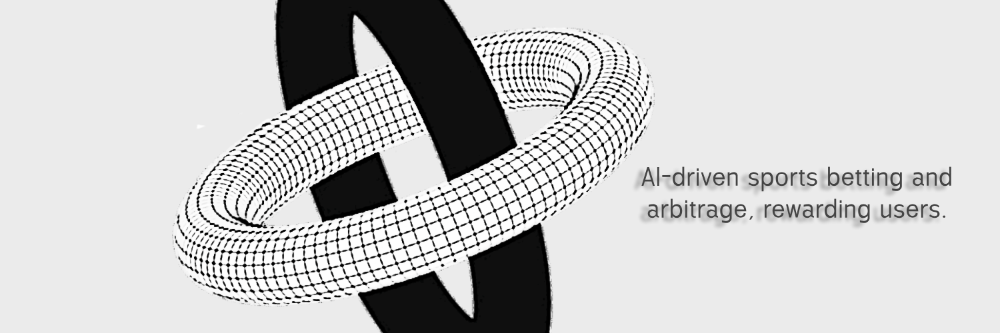

# podds defAI Protocol

<div align="center">
  <h3>Advanced AI-Powered Sports Trading Protocol</h3>
  <p>Decentralized sports betting analytics powered by machine learning</p>
</div>

## Overview

Odds AI is a cutting-edge protocol that leverages artificial intelligence to analyze sports betting markets and identify profitable trading opportunities in real-time. By combining advanced machine learning models with high-frequency market data, Odds AI provides institutional-grade analytics to retail traders.

## Key Features

- **Real-Time Market Analysis**: Continuous monitoring of 80+ bookmakers
- **ML-Powered Predictions**: Advanced modeling using historical and live data
- **Arbitrage Detection**: Automated identification of risk-free opportunities
- **Performance Analytics**: Detailed metrics and ROI tracking
- **Rewards System**: Token-based incentive structure for holders
- **Institutional Grade**: Built for professional sports traders

## Technology Stack

- **Frontend**: React 18, TypeScript, Tailwind CSS
- **State Management**: React Context + Hooks
- **Animations**: Framer Motion
- **Data Visualization**: Custom SVG charts
- **AI/ML Stack**: GPT-4 Turbo
- **Build Tools**: Vite, PostCSS

## Getting Started

```bash
# Clone the repository
git clone https://github.com/oddsAI/odds-ai.git

# Install dependencies
npm install

# Start development server
npm run dev

# Build for production
npm run build
```

## Architecture

```
src/
├── components/         # React components
├── hooks/             # Custom React hooks
├── utils/             # Helper functions
├── types/             # TypeScript definitions
└── assets/           # Static assets
```

## Performance Metrics

- Win Rate: 83.4%
- ROI: 133.57%
- Total Trades: 247
- Average Hold Time: 3.2 hours

## Tokenomics

- **Total Supply**: 100,000,000 ODDS
- **Distribution**: 
  - 40% Trading Rewards
  - 30% Development
  - 20% Liquidity
  - 10% Team (locked)
- **Rewards**: 20 epochs/month

## Security

- Regular third-party audits
- Real-time risk monitoring
- Automated circuit breakers
- Multi-signature governance

## Roadmap

- [x] MVP Launch
- [x] Initial AI Model Training
- [ ] Advanced Market Making
- [ ] Cross-Chain Integration
- [ ] Mobile App Release
- [ ] DAO Governance

## Contributing

We welcome contributions! Please read our [Contributing Guidelines](CONTRIBUTING.md) before submitting a pull request.

## License

This project is licensed under the MIT License - see the [LICENSE](LICENSE) file for details.

## Disclaimer

Trading sports involves substantial risk of loss. Past performance is not indicative of future results. This software is for informational purposes only.

## Contact

- Website: [oddsai.com](https://poddsai.xyz)
- Twitter: [@OddsAI](https://twitter.com/poddsai)
- Telegram: coming soon

## Acknowledgments

Special thanks to our early contributors and the open-source community.

---

<div align="center">
  <sub>Built with ❤️ by the Odds AI Team</sub>
</div>
