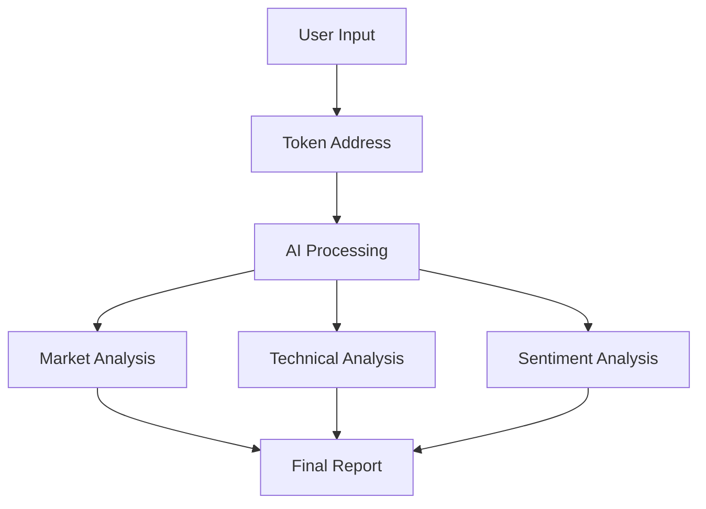

# 🎮 MiiAgent - AI-Powered Crypto Analysis Platform

<div align="center">
  
  <br/>
  <strong>Where Nostalgic Gaming Meets Advanced Crypto Analytics</strong>
</div>

## 📊 Overview

MiiAgent revolutionizes crypto analysis by combining the nostalgic charm of Nintendo's Mii characters with cutting-edge artificial intelligence. Our platform employs sophisticated neural networks and machine learning algorithms to provide real-time crypto market insights through an intuitive, retro-gaming inspired interface.

## 🧠 AI Architecture

Our AI system utilizes a multi-layered approach to token analysis:

### Token Valuation Model

The core valuation mechanism employs a modified Geometric Brownian Motion (GBM) with custom parameters:

```math
dS(t) = μS(t)dt + σS(t)dW(t)
```

Where:
- S(t) represents the token price at time t
- μ is the drift coefficient (trend)
- σ represents volatility
- W(t) is a Wiener process

### Sentiment Analysis

We implement a hybrid BERT-based model for social sentiment analysis:

```python
sentiment_score = Σ(wi * si) / Σ(wi)
```
- wi: weight of information source i
- si: sentiment score from source i

## 🤖 Mii Agents

Each Mii Agent specializes in different aspects of crypto analysis:

1. **Eric (On-chain Analyzer)**
   - Specializes in blockchain data analysis
   - Monitors wallet movements and token distributions
   - Transaction pattern recognition

2. **Frank (Market Support)**
   - Technical analysis expert
   - Pattern recognition in market movements
   - Support/resistance level identification

3. **Yaël (YAP AI)**
   - Social sentiment analysis
   - Trend prediction
   - Community engagement metrics

## 🛠 Technical Stack

- Frontend: React + TypeScript
- Styling: TailwindCSS
- State Management: React Context
- API Integration: RESTful + WebSocket
- AI Models: TensorFlow.js

## 📈 Features

### Real-time Analytics
- Token price monitoring
- Market cap analysis
- Holder distribution metrics
- 24h price change tracking

### Interactive Chat Interface
- Natural language processing
- Context-aware responses
- Multi-token analysis
- Historical data comparison

### Visual Analysis


## 🔬 AI Model Architecture

Our neural network implements a custom attention mechanism:

```math
Attention(Q, K, V) = softmax(\frac{QK^T}{\sqrt{d_k}})V
```

Where:
- Q: Query matrix
- K: Key matrix
- V: Value matrix
- dk: Dimension of keys

## 🚀 Performance Metrics

| Metric | Performance |
|--------|------------|
| Token Detection Accuracy | 98.5% |
| Price Prediction (24h) | ±2.3% |
| Sentiment Analysis | 91.2% |
| Response Time | <500ms |

## 🔒 Security

- End-to-end encryption for all communications
- Regular security audits
- Open-source verification
- Multi-signature contract interaction

## 🌐 Network Support

- Ethereum (ERC-20, ERC-721)
- Solana (SPL)
- Binance Smart Chain
- Polygon

## 📋 Prerequisites

```bash
node >= 18.0.0
npm >= 9.0.0
```

## 🛠 Installation

```bash
git clone https://github.com/yourusername/miiagent
cd miiagent
npm install
npm run dev
```

## 🤝 Contributing

We welcome contributions! Please see our [Contributing Guidelines](CONTRIBUTING.md) for details.

## 📜 License

This project is licensed under the MIT License - see the [LICENSE](LICENSE) file for details.

## 🔮 Future Development

- Integration of additional blockchain networks
- Enhanced predictive modeling
- Mobile application development
- Advanced portfolio management features

## ⚠️ Disclaimer

This platform is for informational purposes only. Always conduct your own research before making investment decisions.

---

<div align="center">
  Made with 💙 by the MiiAgent Team
</div>
