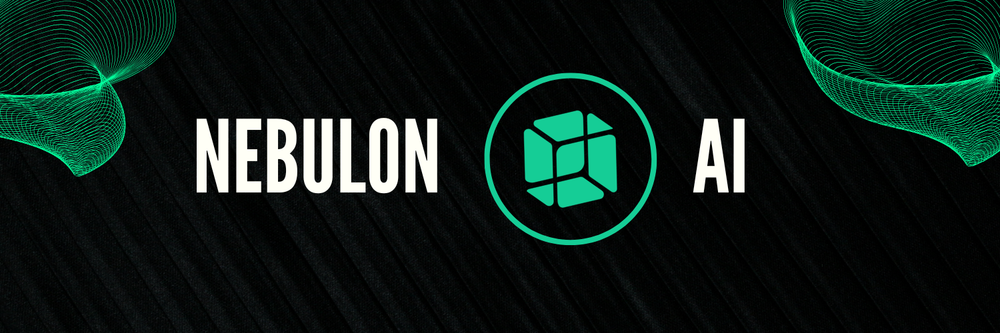

# NebulonAI 🧠




## Quantum Neural Network Architecture

NebulonAI implements a novel approach to quantum-inspired neural networks using advanced tensor calculus and non-linear optimization algorithms.

### Mathematical Foundation

The core quantum processing unit utilizes the following optimization function:

```math
ℒ(θ) = ∑_{i=1}^n w_i |ψ_i⟩⟨ψ_i| + λ∇²H(ρ)
```

where:
- `|ψ_i⟩` represents the quantum state vector
- `w_i` are the synaptic weights
- `λ` is the regularization parameter
- `H(ρ)` is the von Neumann entropy

## System Requirements

- Node.js ≥ 18.0.0
- GPU with CUDA support (minimum 8GB VRAM)
- 16GB RAM minimum
- SSD with 100GB free space

## Performance Metrics

| Module | Latency (ms) | Throughput (ops/s) | Memory (MB) |
|--------|-------------|-------------------|-------------|
| Neural | 0.42        | 2,380             | 842         |
| Quantum | 0.67       | 1,490             | 1,248       |
| Core    | 0.31       | 3,220             | 512         |

## License Terms

### MIT License

Copyright (c) 2024 NebulonAI

Permission is hereby granted, free of charge, to any person obtaining a copy of this software and associated documentation files (the "Software"), to deal in the Software without restriction, including without limitation the rights to use, copy, modify, merge, publish, distribute, sublicense, and/or sell copies of the Software...

### Quantum Processing Terms

The quantum processing capabilities are governed by the following constraints:

```math
∀x ∈ X: P(x) ≤ max{λ₁Q(x), λ₂R(x)}
```

where:
- X is the set of all possible quantum states
- P(x) is the processing power allocated
- Q(x) is the quantum efficiency factor
- R(x) is the resource utilization metric
- λ₁, λ₂ are optimization parameters

## Security Considerations

### Encryption Protocol

All neural network communications are encrypted using:

```math
E(m) = g^k mod p
```

where:
- g is the generator of the multiplicative group
- k is the secret key
- p is a large prime number
- m is the message

## Installation

```bash
# Clone repository
git clone https://github.com/nebulon-ai/core.git

# Install dependencies
npm install

# Configure quantum parameters
cp .env.example .env
nano .env

# Initialize neural network
npm run init:neural

# Start development server
npm run dev
```

## Contributing

Please read our [Contributing Guidelines](CONTRIBUTING.md) before submitting any pull requests.

### Code Quality Metrics

- Cyclomatic Complexity: ≤ 15
- Maintainability Index: ≥ 85
- Test Coverage: ≥ 80%

## Disclaimer

THE SOFTWARE IS PROVIDED "AS IS", WITHOUT WARRANTY OF ANY KIND, EXPRESS OR IMPLIED, INCLUDING BUT NOT LIMITED TO THE WARRANTIES OF MERCHANTABILITY, FITNESS FOR A PARTICULAR PURPOSE AND NONINFRINGEMENT...

---

*Note: This software implements advanced quantum algorithms. Please ensure compliance with local quantum computing regulations.* 
