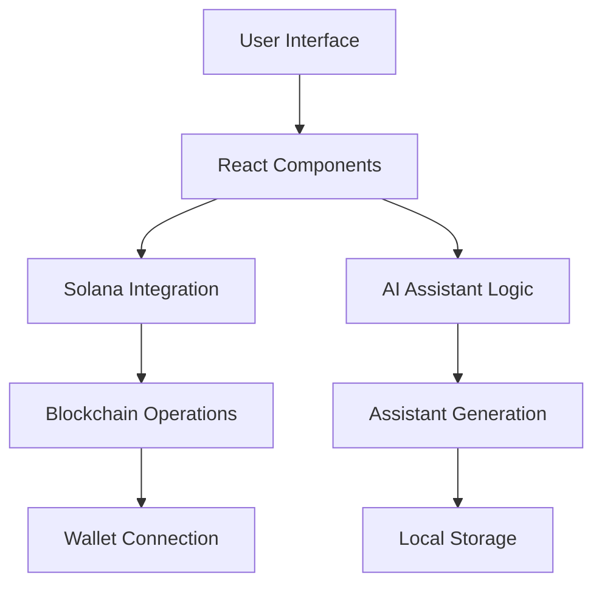

[KaawaiiAI](KawaiiAI.png)

# 🌸 Kawaii AI Assistant Generator 🌸

<div align="center">


*An advanced AI assistant creation platform combining cutting-edge technology with kawaii aesthetics* ✨

</div>

## 🎀 System Architecture

### Core Components
- **Frontend Layer**: React 18 + TypeScript + Vite
- **Blockchain Integration**: Solana Web3.js + Phantom Wallet
- **State Management**: Local Storage + Real-time Updates
- **UI Framework**: Custom Tailwind Components + Kawaii Design System
- **Authentication**: Solana Wallet Authentication
- **Notification System**: React-Toastify with Custom Styling

### Technical Stack Breakdown


## 🌟 Features

### AI Assistant Creation
- **Dynamic Personality Matrix** 
  - Tsundere Mode 💖
  - Genki System ⭐
  - Kuudere Analytics 🎯

### Blockchain Integration
- **Solana Wallet Connection**
  - Phantom Wallet Support
  - Transaction Handling
  - Secure Authentication

### Real-time Interaction
- **WebSocket Communication**
- **State Persistence**
- **Event-driven Updates**

## 🚀 Installation

### Prerequisites
```bash
Node.js >= 16.0.0
npm >= 7.0.0
Solana CLI tools
Phantom Wallet
```

### Development Setup
1. **Clone & Install**
```bash
git clone https://github.com/your-username/kawaii-ai-assistant.git
cd kawaii-ai-assistant
npm install
```

2. **Environment Configuration**
```bash
# Create .env file
cp .env.example .env

# Configure required variables
VITE_OPENAI_API_KEY=your_key_here
VITE_SOLANA_RPC_URL=your_rpc_here
```

3. **Start Development Server**
```bash
npm run dev
```

## 💎 Technical Implementation

### Component Architecture
```typescript
interface Assistant {
  id: string;
  name: string;
  personality: PersonalityType;
  avatar: string;
  createdAt: Date;
}

type PersonalityType = 'tsundere' | 'genki' | 'kuudere';
```

### State Management
- Local Storage Persistence
- Real-time State Updates
- Event-driven Architecture

### Styling System
- Custom Tailwind Configuration
- Responsive Design
- Kawaii Design Principles
- Animation Framework

## 🔧 Configuration

### Tailwind Setup
```javascript
module.exports = {
  theme: {
    extend: {
      colors: {
        'primary-pink': '#FFB6C1',
        'light-pink': '#FFC0CB',
        'dark-pink': '#FF69B4',
      },
      // ... other configurations
    }
  }
}
```

### Vite Configuration
```typescript
export default defineConfig({
  plugins: [react()],
  server: {
    port: 3000,
    host: true
  },
  // ... other configurations
})
```

## 🌈 Usage Examples

### Creating an AI Assistant
```typescript
const createAssistant = async () => {
  const assistant = {
    name: "Mochi",
    personality: "genki",
    avatar: "avatar1"
  };
  // Implementation details...
};
```

## 🔐 Security Considerations

### Wallet Integration
- Secure Key Management
- Transaction Signing
- Error Handling

### Data Persistence
- Local Storage Encryption
- State Management Security
- Input Validation

## 🎨 Design Philosophy

### Kawaii Principles
- Cute & Friendly Interface
- Emotional Connection
- Playful Interactions
- Soft Color Palette

### User Experience
- Intuitive Navigation
- Responsive Design
- Smooth Animations
- Helpful Feedback

## 🤝 Contributing

### Development Process
1. Fork the repository
2. Create feature branch
3. Implement changes
4. Submit pull request

### Code Style
- ESLint Configuration
- Prettier Formatting
- TypeScript Strict Mode
- Component Documentation

## 📚 Documentation

### API Reference
- Assistant Creation
- Personality Management
- Avatar Selection
- State Persistence

### Component Library
- UI Components
- Utility Functions
- Helper Classes
- Type Definitions

## 🌟 Future Roadmap

### Planned Features
- [ ] Multiple AI Models Support
- [ ] Advanced Personality Customization
- [ ] NFT Integration
- [ ] Cross-chain Compatibility

## 💝 Support & Community

- Discord Server
- Twitter Updates
- GitHub Discussions
- Documentation Wiki

## 📜 License

MIT License - See [LICENSE](LICENSE) for details

---

<div align="center">
Made with 💖 and sprinkled with ✨kawaii magic✨

*Remember: Every line of code is an opportunity to make something cute!* (◕‿◕✿)
</div>
